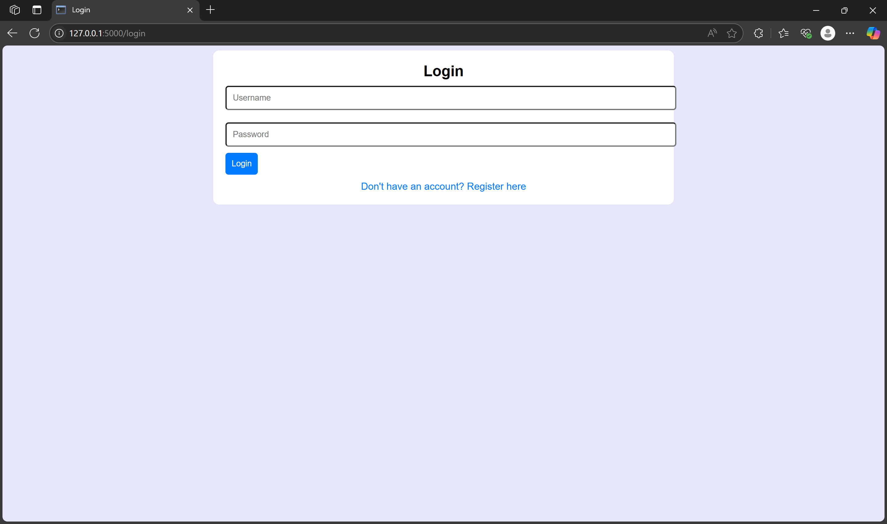
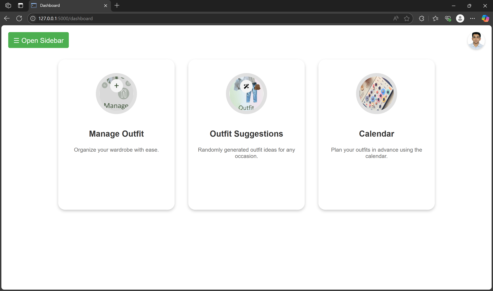
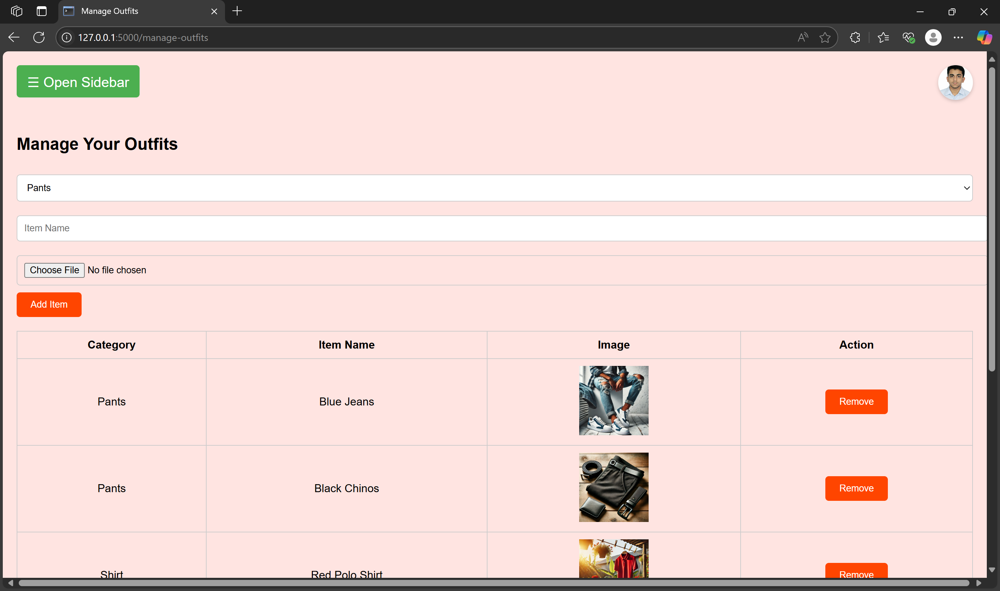
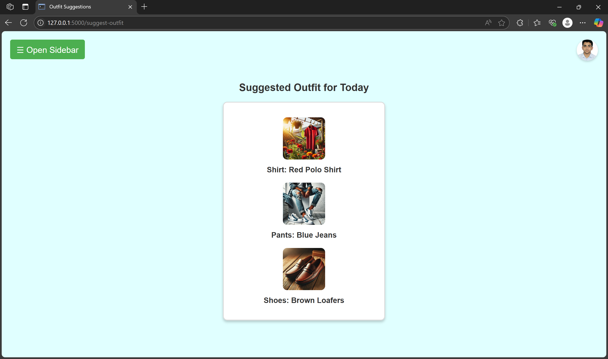

# Wardrobe Management System

This is a web application for managing wardrobes, suggesting outfits, and organizing outfits on a calendar. It is built with Flask, uses MySQL for the database, and includes a sidebar with navigation and a dropdown for profile settings.

## Features

- User registration and login with profile picture upload.
- Sidebar for navigation between pages:
  - **Dashboard**
  - **Manage Outfits**
  - **Outfit Suggestions**
  - **Calendar**
- Outfit management, including adding and removing items.
- Random outfit suggestion feature.
- Calendar to organize outfits by date.

## Technologies Used

- **Backend**: Flask
- **Database**: MySQL
- **Frontend**: HTML, CSS, JavaScript

---

## Installation and Setup

### Clone the Repository
```bash
git clone https://github.com/your-username/wardrobe-management-system.git
cd wardrobe-management-system
```

### Create and Activate a Virtual Environment
For Windows:
```bash
python -m venv venv
venv\Scripts\activate
```
For macOS/Linux:
```bash
python3 -m venv venv
source venv/bin/activate
```

### Install Requirements
```bash
pip install -r requirements.txt
```

### MySQL Configuration
1. Make sure MySQL is installed and running on your local machine.
2. Create a database named `wardrobe_management`:
   ```sql
   CREATE DATABASE wardrobe_management;
   ```
3. Update the `.env` file with your MySQL configuration:
   ```env
   MYSQL_HOST=localhost
   MYSQL_USER=root
   MYSQL_PASSWORD=yourpassword
   MYSQL_DATABASE=wardrobe_management
   ```
4. Import the `schema.sql` file into the database:
   ```bash
   mysql -u root -p wardrobe_management < schema.sql
   ```

### Run the Application Locally
1. Start the Flask development server:
   ```bash
   python app.py
   ```
2. Open your browser and go to `http://127.0.0.1:5000/`.

---

## Deployment

### Using Render.com
1. Create an account on [Render](https://render.com/).
2. Set up a new **Web Service**:
   - Connect your GitHub repository.
   - Specify the start command: `python app.py`.
3. Set up a new **MySQL Database**:
   - Copy the connection details into the `.env` file.
4. Push changes to GitHub to trigger deployment.

---

## File Structure
```plaintext
wardrobe-management-system/
├── static/
│   ├── css/
│   ├── images/
│   ├── js/
│   └── uploads/
├── templates/
│   ├── base.html
│   ├── dashboard.html
│   ├── login.html
│   ├── register.html
│   ├── manage_outfits.html
│   ├── outfit_suggestion.html
│   └── calendar.html
├── app.py
├── requirements.txt
├── schema.sql
├── .env
├── .gitignore
└── README.md
```

---

## Environment Variables
Ensure the `.env` file contains the following:
```env
MYSQL_HOST=your_mysql_host
MYSQL_USER=your_mysql_user
MYSQL_PASSWORD=your_mysql_password
MYSQL_DATABASE=wardrobe_management
SECRET_KEY=your_secret_key
UPLOAD_FOLDER=static/uploads
```

## Screenshots

### 1. Login


### 2. Dashboard


### 3. Manage Outfits


### 4. Outfit Suggestions


## Contributing

1. Fork the repository.
2. Create a new branch for your feature: `git checkout -b feature-name`.
3. Commit your changes: `git commit -m 'Add some feature'`.
4. Push to the branch: `git push origin feature-name`.
5. Open a pull request.

## Contributors
- **Rehan** - [GitHub Profile](https://github.com/rehann-ahmed)
- **Email**: rehanahmed653@gmail.com

Feel free to contribute to this project by submitting issues or pull requests.

